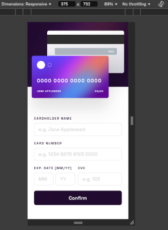
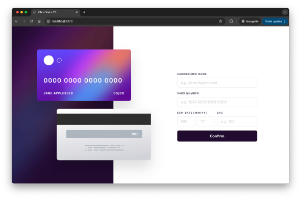

# Frontend Mentor - Interactive card details form app

# Frontend Mentor - Interactive card details form app solution

This is a solution to the [Interactive card details form app challenge on Frontend Mentor](https://www.frontendmentor.io/challenges/interactive-card-details-form-XpS8cKZDWw). Frontend Mentor challenges help you improve your coding skills by building realistic projects.

## Table of contents

- [Overview](#overview)
  - [The challenge](#the-challenge)
  - [Screenshot](#screenshot)
  - [Links](#links)
- [My process](#my-process)
  - [Built with](#built-with)
  - [What I learned](#what-i-learned)
  - [Continued development](#continued-development)
  - [Useful resources](#useful-resources)
- [Author](#author)
- [Acknowledgments](#acknowledgments)

## Overview

### The challenge

Users should be able to:

- Fill in the form and see the card details update in real time
- Receive error messages when the form is submitted if:
  - Any input field is empty
  - The card number, expiry date, or CVC fields are in the wrong format
- View the optimal layout depending on their device's screen size
- See hover, active, and focus states for interactive elements on the page

### Screenshot

### Links

- Repository URL: [github.com/ironest/interactive-card-details-form](https://github.com/ironest/interactive-card-details-form)
- Live Demo URL: [interactive-card-details-form-violet.vercel.app/](https://interactive-card-details-form-violet.vercel.app/)

## My process

### Built with

- Semantic HTML5 markup
- CSS custom properties
- Flexbox
- Mobile-first workflow
- Media Queries
- Vue Js (v3 and Composition API)
- Vuex
- Vee-validate
- Zod

### Useful resources

- [Google Fonts](https://fonts.google.com/) - Google Fonts provides an API to get the desired fonts to your web pages.
- [Photopea](https://www.photopea.com/) - This is a web-based photo and graphics editor. It is used for image editing, making illustrations, web design. I've used it to derive color/sizes/spacing from the provided designs

## Author

- Linkedin - [@carzanigariccardo](https://www.linkedin.com/in/carzanigariccardo/)
- Github - [@ironest](https://www.github.com/ironest)
- Instagram - [@ironest](https://www.instagram.com/ironest)

## Acknowledgments

None
